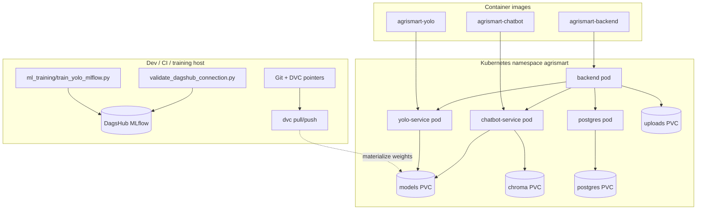

# AgriSmart — Deployment & MLOps Architecture Report

This document is a **single consolidated report** of the AgriSmart platform’s deployment topology, supporting infrastructure, data/versioning practices, experiment tracking, and operational safeguards. It is intended for handover, audits, and viva-style explanations of how the system is built and why design choices were made.

---

## 1. Executive summary

AgriSmart is a **multi-service agricultural intelligence stack** composed of:

| Service | Role | Default port (Compose) |
|---------|------|-------------------------|
| **backend** | Flask API, orchestrates uploads, calls YOLO and chatbot over HTTP | 5000 |
| **yolo-service** | Ultralytics-based detection API; loads per-crop `best.pt` from `/models` | 8001 |
| **chatbot-service** | RAG chatbot (LangChain + Chroma + embeddings) | 8002 |
| **postgres** | Relational data for the backend | 5432 |

**Deployment targets:**

1. **Docker Compose** — local and CI-style full stack with bind mounts for models and (for chatbot) live code under `Backend/chatbot`.
2. **Kubernetes** — namespace `agrismart`, same logical services, **PVC-backed** persistence, init containers enforcing dependency order, optional **production overlay** (image tags, JSON logs, PDBs).

**Data & ML governance:**

- **DVC** — large artifacts and datasets tracked via `.dvc` pointers; restore with `dvc pull`.
- **MLflow via DagsHub** — experiment tracking and run artifacts for **training and optional ingest jobs**; **not** used for model serving in production.
- **`models/metadata.json`** — lightweight per-crop metadata (version, MLflow run id, optional DVC ref).

**Stability principle:** inference paths do not require MLflow or DagsHub; tracking is **feature-flagged** and failures degrade gracefully.

---

## 2. Logical architecture

### 2.1 Request and dependency flow

```mermaid
flowchart TB
  subgraph clients[Clients]
    APP[Mobile / Web / curl]
  end
  subgraph edge[API tier]
    BE[backend Flask]
  end
  subgraph ml[ML tier]
    YO[yolo-service]
    CB[chatbot-service]
  end
  subgraph data[(Data stores)]
    PG[(PostgreSQL)]
    CH[(Chroma on PVC / volume)]
    MD[/models weights/]
  end
  APP --> BE
  BE --> YO
  BE --> CB
  BE --> PG
  YO --> MD
  CB --> CH
  CB --> MD
```

- The **backend** is the only service meant to be user-facing in the default Kubernetes layout (NodePort on `backend-service`; optional Ingress).
- **YOLO** and **chatbot** are internal HTTP dependencies; backend can be configured with strict “no local fallback” mode for production parity (`ENABLE_LOCAL_*_FALLBACK=false` in Kubernetes ConfigMap).

### 2.2 Repository layout (deployment-relevant)

| Path | Purpose |
|------|---------|
| `docker-compose.yml` | Four services, named images `agrismart-*:latest`, healthchecks, volumes |
| `docker/*.Dockerfile` | Per-service images (backend, chatbot, yolo) |
| `scripts/docker-entrypoint-*.sh` | Container startup (e.g. model download hooks for YOLO) |
| `kubernetes/` | Kustomize base: namespace, config, secrets, storage, services, deployments |
| `kubernetes/overlays/production/` | Production example: semver image tags, JSON logging patch, PDBs |
| `kubernetes/ingress/` | Optional NGINX Ingress manifest (not in base `kustomization`) |
| `kubernetes/helpers/models-loader-pod.yaml` | Ephemeral pod to receive `kubectl cp` of weights onto PVC |
| `.github/workflows/ci.yml` | Python compileall, Docker builds, `kubectl kustomize` + dry-run |
| `scripts/compose-runtime-validation.ps1` | Compose bring-up and HTTP/runtime checks; writes report |
| `scripts/dvc_*.sh`, `scripts/dvc-workflow.md` | DVC pull/push/status helpers and workflow narrative |
| `common/` | Shared utilities (`mlflow_utils`, `model_metadata`, logging/observability per PRODUCTION_READINESS) |
| `ml_training/` | Training-only deps + `train_yolo_mlflow.py`, `validate_dagshub_connection.py` |
| `datasets/wheat/` | Example YOLO dataset scaffold (`data.yaml` + empty image/label dirs) |
| `docs/PRODUCTION_READINESS.md` | Logging, metrics, rate limits, scaling notes |
| `docs/MLOPS_DAGSHUB_MLFLOW.md` | DagsHub + MLflow + DVC relationship and runbooks |

---

## 3. Docker & Docker Compose

### 3.1 Services (from `docker-compose.yml`)

- **postgres:16** — database `agrismart`, healthcheck `pg_isready`, volume `postgres_data`.
- **yolo-service** — build `docker/yolo.Dockerfile`, `MODEL_DIR=/models`, optional `MODEL_DOWNLOAD_URL_*` for startup fetch, port **8001**, `./models:/models`, readiness `GET /ready`.
- **chatbot-service** — build `docker/chatbot.Dockerfile`, embedding caches under `/models/*`, `./Backend/chatbot` bind-mount for rapid iteration, `./models:/models`, port **8002**, readiness `GET /ready`.
- **backend** — build `docker/backend.Dockerfile`, `depends_on` with **healthy** conditions for postgres, yolo, chatbot; `DATABASE_URL`, service URLs, `MODEL_DIR`, uploads volume, port **5000**, `GET /health` healthcheck.

### 3.2 Image naming and Kubernetes alignment

Compose declares **`image: agrismart-backend:latest`** (and chatbot/yolo) so local builds match Kubernetes manifest image names; Docker Desktop Kubernetes can run `IfNotPresent` without a registry when images exist on the host.

### 3.3 Operational notes

- Chatbot ingest without image rebuild:  
  `docker compose run --rm --entrypoint python chatbot-service Backend/chatbot/ingest.py`  
  (avoids Windows PowerShell empty `--entrypoint` pitfalls documented elsewhere in the repo).

---

## 4. Kubernetes deployment

### 4.1 Base Kustomization (`kubernetes/kustomization.yaml`)

**Namespace:** `agrismart`.

**Resources (order of concern):**

- **ConfigMap** `agrismart-config` — non-secret env: URLs, ports, `MODEL_DIR`, cache dirs, log format, rate limit string, **`MLFLOW_TRACKING_ENABLED=0`**, **`MLFLOW_TRACK_CHATBOT_INGEST=0`** (safe defaults).
- **Secret** `agrismart-secrets` — Postgres credentials, `DATABASE_URL`, `SECRET_KEY`, optional LLM API keys, **placeholder** `DAGSHUB_*` keys for optional Jobs (empty in committed YAML; populate in cluster).
- **Storage PVCs** — `postgres`, `chroma`, `uploads`, `models` (typically RWO).
- **Services** — `postgres-service`, `yolo-service`, `chatbot-service`, `backend-service` (backend exposed via **NodePort** in the documented baseline).
- **Deployments** — four workloads with probes, resource requests/limits, security context patterns described in `docs/PRODUCTION_READINESS.md`.

### 4.2 Startup ordering (backend)

The **backend** Deployment uses **init containers** to wait for:

1. Postgres TCP (`postgres-service:5432`)
2. YOLO `GET http://yolo-service:8001/ready`
3. Chatbot `GET http://chatbot-service:8002/ready`

This mirrors Compose `depends_on: condition: service_healthy` and prevents a half-ready API.

### 4.3 Models on Kubernetes (critical path)

YOLO **`/ready`** expects weight files on the models volume:

- `/models/wheat/best.pt`
- `/models/rice/best.pt`
- `/models/cotton/best.pt`

PVCs start **empty**. The repo documents:

1. Apply **`kubernetes/helpers/models-loader-pod.yaml`**, copy weights (prefer **per-file** `kubectl cp` on Windows/OneDrive — recursive copy often fails with tar mode errors).
2. Delete loader pod, **rollout restart** yolo and backend.

Alternatively, set **`MODEL_DOWNLOAD_URL_*`** on the YOLO deployment and use the entrypoint download path (same idea as Compose).

### 4.4 Production overlay (`kubernetes/overlays/production/`)

- **Pins image tags** to `v1.0.0` for all three AgriSmart images (replace per release).
- **Patches ConfigMap** for **JSON log lines** (`AGRISMART_LOG_FORMAT=json`).
- **Adds PDBs** from `kubernetes/policies/poddisruptionbudgets.yaml`.

Build / validate:

```bash
kubectl kustomize kubernetes/
kubectl kustomize kubernetes/overlays/production/
```

CI runs **client-side dry-run** apply for both.

### 4.5 Ingress (optional)

`kubernetes/ingress/backend-ingress.yaml` defines an **nginx** Ingress class, host `agrismart.local`, upload size annotation. It is **not** included in the base kustomization so NodePort workflows stay the default; apply when an ingress controller exists.

### 4.6 Autoscaling (optional)

`kubernetes/autoscaling/backend-hpa.yaml` exists for horizontal scaling when metrics-server and suitable storage for multi-replica uploads are available (see production doc caveats).

---

## 5. CI/CD pipeline

**Workflow:** `.github/workflows/ci.yml`

| Stage | Action |
|-------|--------|
| **validate-python** | `python -m compileall -q` on `common`, `Backend`, `chatbot_service`, `yolo_service`, `ml_training` |
| **docker-build** | Builds three images with `docker/backend.Dockerfile`, `docker/chatbot.Dockerfile`, `docker/yolo.Dockerfile` (no registry push) |
| **kubernetes-manifests** | `kubectl kustomize` base + production overlay; `kubectl apply --dry-run=client -k` |

**Recommended release flow** (from production readiness doc): tag images → update overlay image tags → apply Kustomize → verify probes and metrics.

---

## 6. Runtime validation (Compose)

**Script:** `scripts/compose-runtime-validation.ps1`

- Optionally runs `docker compose up -d`, captures container status and **tail logs** for all four containers.
- Exercises **HTTP** endpoints on the backend base URL (default `http://127.0.0.1:5000`): health, readiness, dependency health, and related routes per script phases.
- Writes **`scripts/compose-validation-report.txt`** for a timestamped audit trail.

Use this after infrastructure or dependency changes to prove the stack still satisfies runtime contracts.

---

## 7. DVC integration

**Goal:** keep Git lightweight while versioning large artifacts (models, Chroma DB snapshots, datasets) via **content-addressed storage** and remotes.

**Project artifacts:**

- `.dvc/` configuration and cache present in the repo layout.
- Workflow documentation: **`scripts/dvc-workflow.md`** and root **`README.md`** (high-level collaboration: `dvc add` → commit `.dvc` files → `dvc push`; teammates `git pull` + `dvc pull`).

**Shell helpers:** `scripts/dvc_pull.sh`, `scripts/dvc_push.sh`, `scripts/dvc_status.sh` wrap `python -m dvc …`.

**Relationship to deployment:**

- **Compose:** bind-mount `./models`; populate from `dvc pull` or manual copy.
- **Kubernetes:** populate the **models PVC** (loader pod + `kubectl cp` or download URLs).

**Relationship to MLflow:**

- Orthogonal: DVC answers **which blob of data**; MLflow answers **which experiment run** produced metrics and optional artifacts. Training can pass **`DVC_DATASET_REV`** / **`DVC_ARTIFACT_REF`** (and script flags) into params and into `models/metadata.json`.

---

## 8. MLOps: DagsHub + MLflow (training-centric)

Detailed runbook and diagrams: **`docs/MLOPS_DAGSHUB_MLFLOW.md`**.

### 8.1 Design constraints (explicit)

- **No** MLflow model serving in the inference path.
- **No** requirement for MLflow in yolo/chatbot/backend containers for normal operation.
- **Credentials only** via environment variables or Kubernetes Secrets — never hardcoded in application source.

### 8.2 Configuration surface

| Variable | Role |
|----------|------|
| `MLFLOW_TRACKING_ENABLED` | Master switch; default **0** in Kubernetes ConfigMap |
| `DAGSHUB_USERNAME` / `DAGSHUB_REPO_OWNER` | Repo owner for `dagshub.init` |
| `DAGSHUB_REPO_NAME` | Repository name on DagsHub |
| `DAGSHUB_TOKEN` | Auth for MLflow HTTP API (treat as secret) |
| `MLFLOW_HTTP_REQUEST_TIMEOUT` | Optional; defaults applied in code |
| `MLFLOW_TRACK_CHATBOT_INGEST` | Optional logging when running `ingest.py` |
| `MLFLOW_CHATBOT_EXPERIMENT` | Experiment name override for ingest |

**Local:** use repo-root **`.env`** (gitignored); **`.env.example`** lists keys without secrets.

### 8.3 Shared module: `common/mlflow_utils.py`

- **`init_dagshub_mlflow()`** — `dagshub.init(..., mlflow=True)` when enabled and repo vars present.
- **`start_run_safe()`** — context manager with **retries**; does not crash callers on failure.
- **`log_*_safe` helpers** — wrap param/metric/artifact calls in try/except + warnings.
- **`log_chatbot_ingest_run()`** — lightweight optional experiment for vector-store rebuilds.

### 8.4 YOLO training with tracking: `ml_training/train_yolo_mlflow.py`

- Runs **on the host or a training job**, not inside the inference-only yolo image by default.
- Resolves **`--data`** against cwd and **repo root**; supports Ultralytics shorthands like **`coco8.yaml`** for smoke tests.
- Logs typical hyperparameters, `results.csv` metrics, training duration, and artifacts (`best.pt`, confusion matrices / result plots when produced).
- Updates **`models/metadata.json`** via **`common/model_metadata.py`**.

### 8.5 Connectivity check: `ml_training/validate_dagshub_connection.py`

- Forces tracking on for the check, initializes DagsHub/MLflow, creates a short **connectivity** run, optionally runs **`dvc status`**.

### 8.6 Chatbot optional tracking

- **`Backend/chatbot/ingest.py`**: when `MLFLOW_TRACK_CHATBOT_INGEST` is enabled and MLflow packages exist, logs ingest parameters and duration inside a broad try/except so ingest **never** depends on DagsHub availability.

### 8.7 Training dependencies

**`ml_training/requirements.txt`** — `ultralytics`, `mlflow`, `dagshub`, `pandas` (kept **out** of inference images unless you deliberately add them). Set DagsHub/MLflow variables via your shell or a repo-root `.env` loaded by your own tooling.

---

## 9. Observability, resilience, and security (summary)

Full detail: **`docs/PRODUCTION_READINESS.md`**. Highlights:

- **Structured JSON logging** in production overlay; correlation id **`X-Request-ID`**.
- **Prometheus `/metrics`** on backend, yolo-service, chatbot-service (HTTP and YOLO inference histograms where implemented).
- **Rate limiting** on backend (`flask-limiter`), configurable storage URI for multi-replica.
- **Rolling updates** with `maxUnavailable: 0` where applicable; **graceful shutdown** hooks.
- **Secrets management**: do not commit production `DATABASE_URL` or tokens; prefer Sealed Secrets / external secret operators for real clusters.

---

## 10. End-to-end lifecycle (narrative)

1. **Develop** — Compose up; optional DVC pull for models/embeddings; run backend against internal yolo/chatbot URLs.
2. **Train / experiment** — Install `ml_training/requirements.txt`; set DagsHub env; run `train_yolo_mlflow.py`; verify runs in DagsHub UI; commit code + updated `models/metadata.json` as appropriate (not secrets).
3. **Version data** — DVC add/push for large artifacts; record revision in training params or metadata.
4. **Build** — `docker compose build` or CI docker-build job; tag for production.
5. **Deploy K8s** — Apply base or production overlay; seed models PVC; verify init containers and `/ready`.
6. **Operate** — scrape `/metrics`, ship JSON logs, use PDBs/HPA as appropriate; rotate secrets on schedule.

---

## 11. Mermaid — deployment + MLOps (combined view)



---

## 12. Glossary (viva-friendly)

| Term | One-line meaning |
|------|------------------|
| **Compose** | Single-machine orchestration of all services with healthchecks and volumes. |
| **Kustomize** | Kubernetes YAML composition (base + production overlay) without templating sprawl. |
| **PVC** | Persistent volume claim — durable disk for models, DB, uploads, Chroma. |
| **Init container** | Runs to completion before app containers; used here to wait for dependencies. |
| **Readiness** | “Accept traffic only when dependencies and models are ready.” |
| **DVC** | Data version control — Git tracks pointers; remote stores blobs. |
| **MLflow** | Experiment tracking (params, metrics, artifacts); here **not** the inference server. |
| **DagsHub** | Hosted Git + DVC + MLflow UI; `dagshub.init` wires MLflow client to the remote. |
| **Governance metadata** | `models/metadata.json` links deployed weights to training run and data revision concepts. |

---

## 13. Document maintenance

When you change ports, image names, probes, or MLOps flags, update:

- `docker-compose.yml` and matching `kubernetes/deployments/*.yaml` / `configmaps/*.yaml`
- **`docs/PRODUCTION_READINESS.md`** for operational behavior
- **`docs/MLOPS_DAGSHUB_MLFLOW.md`** for experiment workflows
- **This report** for high-level onboarding

---

*Report generated to consolidate AgriSmart deployment architecture, Docker/Kubernetes baselines, DVC usage, runtime validation, and DagsHub/MLflow training integration. For step commands, prefer the linked docs and `kubernetes/README.md`.*
