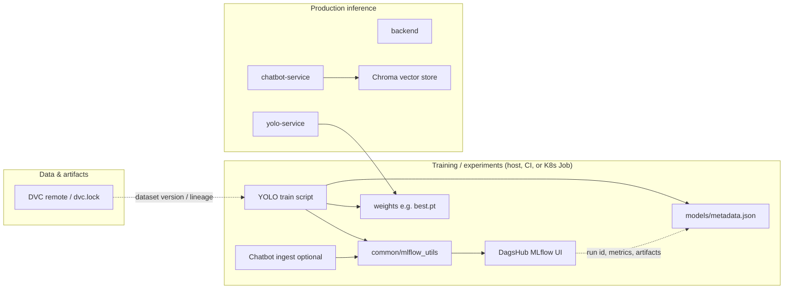

# AgriSmart MLOps: DagsHub, MLflow, and DVC

This document describes how experiment tracking, model metadata, and data versioning fit together **without** changing inference architecture or serving models through MLflow.

## Architecture (high level)



- **DVC**: versions large datasets and binary artifacts in Git-friendly workflows; `dvc.lock` and remotes define *what data* a run used.
- **MLflow (via DagsHub)**: records *what happened* in a training or ingest experiment—parameters, metrics, plots, and optional weight files as artifacts.
- **`models/metadata.json`**: a small, repo-local governance file linking each crop model to framework, version, timestamps, optional MLflow run id, and optional DVC reference.
- **Inference services** load weights from `/models` (or your volume) and do **not** depend on MLflow at runtime.

## Phase 1 — DagsHub initialization

1. Create a DagsHub repo (or connect an existing GitHub repo) and note **owner** and **repo name**.
2. Create a **personal access token** with appropriate scope; never commit it.
3. Set environment variables (see `.env.example`):

   | Variable | Purpose |
   |----------|---------|
   | `MLFLOW_TRACKING_ENABLED` | `1` to turn on tracking |
   | `DAGSHUB_USERNAME` | Account username (repo owner if same) |
   | `DAGSHUB_REPO_NAME` | Repository name on DagsHub |
   | `DAGSHUB_TOKEN` | Token (maps to MLflow HTTP auth) |
   | `DAGSHUB_REPO_OWNER` | Optional if owner ≠ username |

4. Validate connectivity:

   ```bash
   pip install -r ml_training/requirements.txt
   set MLFLOW_TRACKING_ENABLED=1
   python ml_training/validate_dagshub_connection.py
   ```

**DVC compatibility**: DVC and MLflow are orthogonal. Pass a dataset revision into training (`--dataset-version`, `DVC_DATASET_REV`) so runs remain reproducible on the DagsHub UI.

## Phase 2 — Shared module `common/mlflow_utils.py`

Reusable helpers:

- `init_dagshub_mlflow()` — `dagshub.init(..., mlflow=True)` with env-based auth.
- `start_run_safe()` — context manager with retries; swallows failures.
- `log_params_safe`, `log_metrics_safe`, `log_artifact_safe` — non-fatal wrappers.
- HTTP timeout via `MLFLOW_HTTP_REQUEST_TIMEOUT` (default 45s).

Tracking is **off** unless `MLFLOW_TRACKING_ENABLED` is truthy, so Kubernetes defaults stay safe.

## Phase 3 — YOLO experiment tracking

Use **`ml_training/train_yolo_mlflow.py`** (not the inference container):

```bash
pip install -r ml_training/requirements.txt
set MLFLOW_TRACKING_ENABLED=1
set DAGSHUB_USERNAME=...
set DAGSHUB_REPO_NAME=...
set DAGSHUB_TOKEN=...
python ml_training/train_yolo_mlflow.py --crop wheat --data your_dataset.yaml --epochs 100 --name exp1
```

Logged (typical): epochs, lr, optimizer, batch, image size, dataset path/version, Ultralytics version, metrics from `results.csv` (e.g. mAP, precision, recall, losses), training duration, and artifacts: `best.pt`, confusion matrix / results plots when present.

After training, **`models/metadata.json`** is updated for that crop with `mlflow_run_id` and paths.

## Phase 4 — Chatbot experiments (optional)

When rebuilding the vector store on a machine that has `mlflow` and `dagshub` installed:

```bash
set MLFLOW_TRACKING_ENABLED=1
set MLFLOW_TRACK_CHATBOT_INGEST=1
set DAGSHUB_*=...
python Backend/chatbot/ingest.py
```

Logs embedding model, token chunk settings, Chroma version, chunk counts, and ingest duration. Failures print a message and do not block ingest.

## Phase 5 — Model metadata

`models/metadata.json` holds per-crop entries: `model_name`, `version`, `framework`, `dataset_version`, `training_timestamp`, `mlflow_run_id`, `dvc_artifact_ref`, `weights_path`, and optional `extra`.

Updates are performed by the training script via `common/model_metadata.py`.

## Phase 6 — Kubernetes behavior

- ConfigMap sets `MLFLOW_TRACKING_ENABLED=0` and `MLFLOW_TRACK_CHATBOT_INGEST=0` by default.
- Secrets include **empty** `DAGSHUB_*` keys for optional use by **Jobs** or manual `kubectl run`—not required for normal deployments.
- Application code does not import MLflow during normal API startup; optional ingest logging is guarded and wrapped in `try/except`.

## Phase 7 — Secrets

- **Local**: copy `.env.example` → `.env` and fill values; `.env` is gitignored.
- **Cluster**: populate `agrismart-secrets` (or SealedSecrets / external secrets) with real `DAGSHUB_TOKEN` and username; do not commit real tokens.

## Phase 8 — Validation checklist

- [ ] `validate_dagshub_connection.py` succeeds.
- [ ] Training run appears in DagsHub MLflow UI with metrics and artifacts.
- [ ] `models/metadata.json` shows new `mlflow_run_id` and `weights_path`.
- [ ] `dvc pull` / pipeline still works for your data workflow.
- [ ] Inference pods start with default env (tracking off).

## Viva / interview talking points

1. **Reproducibility**: DVC pins data; MLflow pins code hyperparameters and metrics; metadata JSON links a deployed weight file to a run and dataset version.
2. **Separation of concerns**: Training uses MLflow; production serving reads static artifacts—no coupling to the tracking server.
3. **Governance**: Metadata file gives auditors a single place to see version, framework, and lineage pointers.
4. **Safe operations**: Feature flags, timeouts, retries, and broad exception handling prevent experiment tooling from taking down services.
5. **Maintainability**: One shared `mlflow_utils` module avoids duplicating DagsHub setup across YOLO and chatbot flows.
