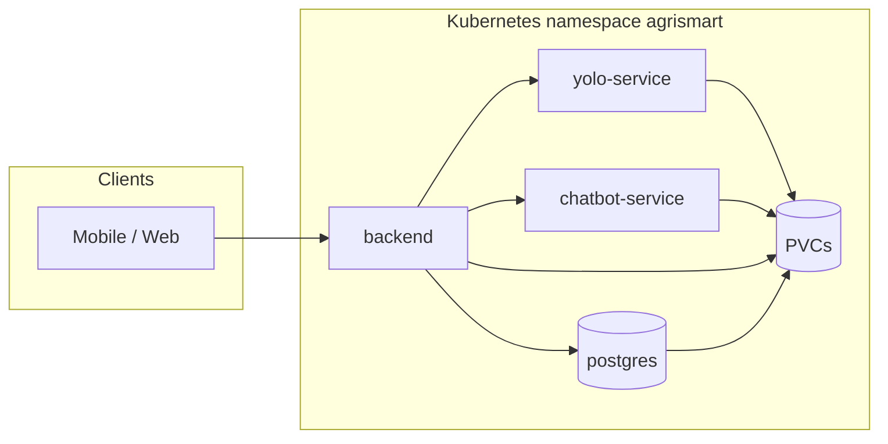
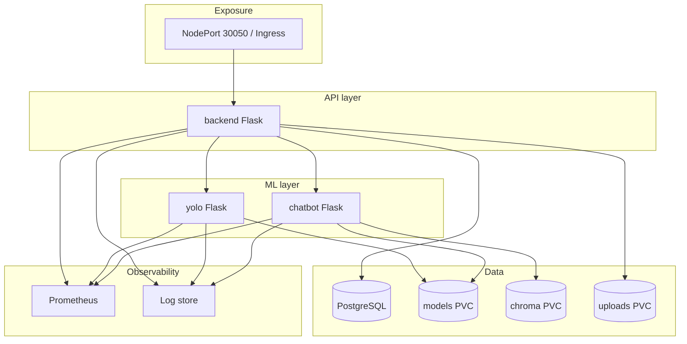

# AgriSmart — Production readiness (post–Step 6)

This document summarizes **production hardening**, **observability**, **CI/CD**, **scaling**, **MLOps**, and **security** added after a working Kubernetes baseline. The **microservice layout and Flask apps are unchanged**.

---

## 1. Architecture overview

- **Public API:** `backend` (NodePort / Ingress).
- **Internal:** `yolo-service`, `chatbot-service`, `postgres` (ClusterIP).
- **Persistence:** PVCs for Postgres, Chroma, uploads, models (RWO; single-node / careful scaling).
- **Strict mode:** `ENABLE_LOCAL_*_FALLBACK=false` preserved.

---

## 2. Kubernetes stability (Phase 1)

| Item | Implementation |
|------|----------------|
| Resources | Requests/limits on all app deployments (existing + reviewed). |
| Rolling updates | `RollingUpdate` with `maxUnavailable: 0`, `maxSurge: 1` (Postgres: `Recreate` + PVC). |
| Graceful shutdown | `terminationGracePeriodSeconds` + `preStop` sleep so probes/LB can drain. |
| Startup | Existing `startupProbe` / `readinessProbe` / `livenessProbe` retained. |
| PDB | `kubernetes/policies/poddisruptionbudgets.yaml` (included via **production overlay**). |
| Security context | `allowPrivilegeEscalation: false` on app containers (no `capabilities.drop` by default — OpenCV/Ultralytics/torch can require extra caps). |

**Validate:** rolling restart each deployment; ensure no `CrashLoopBackOff`; `/ready` stays correct during rollout.

---

## 3. Centralized logging (Phase 2)

- **Structured JSON:** set `AGRISMART_LOG_FORMAT=json` (production overlay patches ConfigMap).
- **Correlation ID:** `X-Request-ID` on requests/responses; propagated in log lines / JSON field `request_id`.
- **Service field:** logger includes service name; JSON includes `service`, `logger`, `level`, `ts`.
- **Startup/shutdown:** `SIGTERM`/`SIGINT` logged via `register_signal_logging`.
- **Noise reduction:** `/health`, `/ready`, `/metrics`, `/warmup` logged at **DEBUG** for request line.

**Aggregation:** ship container stdout to Loki, CloudWatch, Datadog, or ELK; parse JSON lines.

---

## 4. Monitoring & metrics (Phase 3)

- **Prometheus:** `GET /metrics` on **backend**, **yolo-service**, **chatbot-service** (`prometheus_client`).
- **Metrics:**
  - `http_requests_total{service,method,handler,status}`
  - `http_request_duration_seconds_bucket` (histogram)
  - `yolo_inference_duration_seconds_bucket{crop}` (YOLO `model.predict` only)
- **Pod annotations:** `prometheus.io/scrape`, `port`, `path` for scrapers that honor them.
- **Grafana (optional):** add Prometheus datasource; example panels:
  - rate: `sum(rate(http_requests_total[5m])) by (service)`
  - latency: `histogram_quantile(0.95, sum(rate(http_request_duration_seconds_bucket[5m])) by (le, service))`
  - inference: `histogram_quantile(0.95, sum(rate(yolo_inference_duration_seconds_bucket[5m])) by (le, crop))`

---

## 5. CI/CD (Phase 4)

- **GitHub Actions:** `.github/workflows/ci.yml`
  - `python -m compileall` on `common`, `Backend`, `chatbot_service`, `yolo_service`
  - `docker build` for three images (no push)
  - `kubectl kustomize` + `kubectl apply --dry-run=client` for base and `overlays/production`

**Production workflow (you add secrets):**

1. On tag `v*`, build and **push** images to GHCR/ECR/ACR with that tag.
2. `kubectl set image` or `kustomize edit set image` + `kubectl apply -k overlays/production`.
3. Use GitHub Environments + approval gates for prod.

---

## 6. Kubernetes config & environments (Phase 5)

- **Base:** `kubernetes/kustomization.yaml` — dev-friendly defaults.
- **Production example:** `kubernetes/overlays/production/` — JSON logs, image tags `v1.0.0`, PDBs.
- **Secrets:** keep real credentials out of Git; use Sealed Secrets, External Secrets, or cloud secret stores. Update `DATABASE_URL` when DB password changes.
- **Image tagging:** semver tags per release; same tag across backend/yolo/chatbot for traceability.

---

## 7. Scaling (Phase 6)

| Service | Notes |
|---------|--------|
| **backend** | Good candidate for **HPA** (`kubernetes/autoscaling/backend-hpa.yaml`) after **metrics-server** works. Stateless except uploads PVC — use shared storage (RWX) or S3 for multi-replica. |
| **yolo-service** | CPU-heavy; **RWO PVC** limits multi-replica on one node; for scale-out use **ReadWriteMany** volume or model baked in image / object storage + init. |
| **chatbot** | Large memory; embeddings; **sticky sessions** not required for stateless `/chat` if session is in payload; LRU sessions in-process — scaling increases cache duplication. |
| **postgres** | Bottleneck for writes; consider managed RDS/Cloud SQL for prod. |

---

## 8. MLOps (Phase 7)

- **Model version visibility:** `YOLO_MODEL_VERSION` env → JSON field `model_version` + header `X-Model-Version` on yolo `/predict`.
- **DVC:** keep `dvc pull` / CI step to produce `./models`; copy to PVC or bake into image for K8s.
- **Rollback:** redeploy previous image tag; keep model version in release notes.
- **Future:** MLflow registry for artifact + metadata; Airflow for retraining pipelines; separate inference “model server” if needed.

---

## 9. Security (Phase 8)

| Control | Status |
|---------|--------|
| Rate limiting | **Backend:** `flask-limiter` (default `200/min`, exempt `/health`, `/ready`, `/metrics`, `/health/*`). Configure `RATE_LIMIT_DEFAULT`, `RATE_LIMIT_STORAGE_URI` (e.g. Redis URL for multi-replica). |
| Non-root | Not enforced end-to-end (volume permissions); **drop ALL caps** + no privilege escalation on workloads. |
| NetworkPolicy | **Not applied by default** (can break NodePort from host on some CNIs). Add when using Ingress + internal-only rules. |
| CORS | Still env-driven (`ALLOWED_ORIGINS`); tighten for prod. |
| Secrets | Rotate `SECRET_KEY`, DB password; avoid plain manifests in shared repos. |

---

## 10. Persistence strategy

- **Postgres:** PVC (or managed DB).
- **Chroma:** dedicated PVC; seed via ingest job or copy from dev.
- **Models:** PVC or init download URLs; Windows `kubectl cp` directory can fail — copy `best.pt` files individually.
- **Uploads:** PVC; multi-replica backend needs shared object storage.

---

## 11. Deployment workflow (summary)

1. Merge to main → CI validates build + manifests.
2. Tag release → build/push images.
3. `kubectl apply -k kubernetes/overlays/production` (or GitOps).
4. Observe pods, `/ready`, `/health/dependencies`, Prometheus, logs.

---

## 12. Remaining limitations & future work

- Flask dev server in containers — **gunicorn** recommended for heavy prod traffic (same app, different process model).
- **GPU** scheduling not configured.
- **Autoscaling** for yolo/chatbot needs storage/GPU strategy.
- **MLflow / Airflow** — optional integrations only documented.
- **mTLS / service mesh** — not included.

---

## 13. Viva / defense talking points

1. **Why microservices?** Isolate ML inference (YOLO) and RAG (chatbot) from the API monolith; scale and fail independently.
2. **Readiness vs liveness:** Liveness keeps process up; readiness gates traffic until DB + upstream ML services are usable.
3. **PVC vs bind mount:** K8s uses volumes; models must be **loaded** explicitly (unlike Compose `./models`).
4. **Observability:** Correlation IDs for tracing requests; Prometheus metrics for SLOs; JSON logs for aggregation.
5. **CI/CD:** Every change passes syntax check, image build, and manifest dry-run before deploy.
6. **Production safety:** PDBs, rolling updates, preStop, rate limits, secret rotation path.

---

## 14. Production architecture diagram (logical)

---

*Last updated to match repository manifests and application code in the production-hardening pass.*
